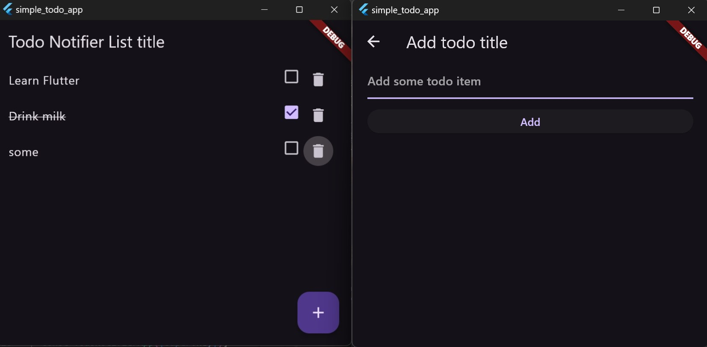

## Getting Started
This project is a starting point for a Flutter application.
A few resources to get you started if this is your first Flutter project:
- [Lab: Write your first Flutter app](https://docs.flutter.dev/get-started/codelab)
- [Cookbook: Useful Flutter samples](https://docs.flutter.dev/cookbook)
For help getting started with Flutter development, view the
[online documentation](https://docs.flutter.dev/), which offers tutorials,
samples, guidance on mobile development, and a full API reference.

# simple_todo (youtube)[https://www.youtube.com/watch?v=VfdTUKt21Ls]
- using TextEditingController & _TodoPageState extends State<TodoPage> {..}

..

# notifier_todo (youtube)[https://www.youtube.com/watch?v=b1Loe5q_Zpc]
- using TextEditingController & TaskNotifier extends ChangeNotifier {..}
- with ChangeNotifierProvider

..
