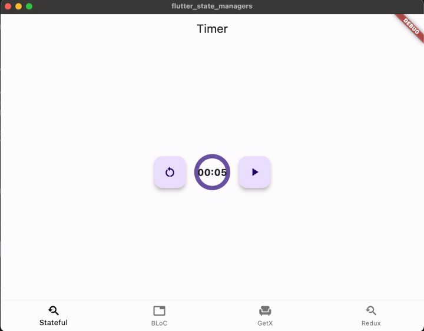
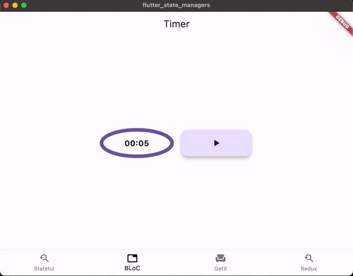
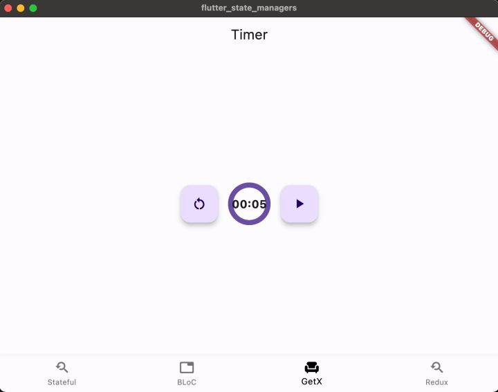
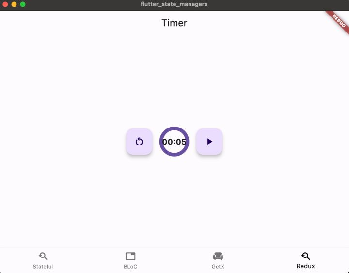
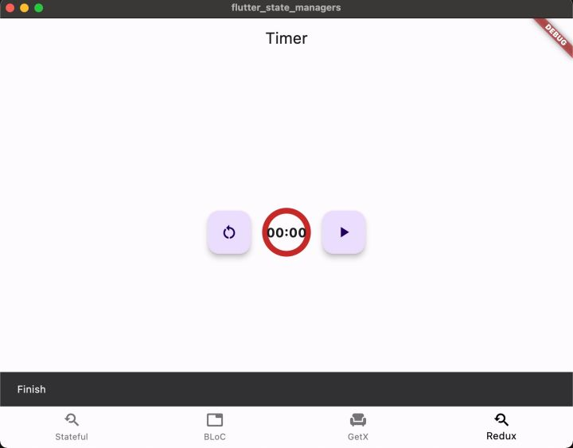

# flutter_timer_lecture
### 1) stateful (720)

..
### 2) bloc (720)

..
### 3) getX (720)
- отличается тем, что finish панелька взлетает над слоями а не из нижней панельки (у всех остальных подходов "finish" как бы высплывает из нижней панельки)

..

..
### 4) redux1 (720)

..

..

# if SDK flutter not found
	https://www.flutterbeads.com/dart-sdk-is-not-configured/

first lecture.

MadTeacher
	https://www.youtube.com/watch?v=F3b7GzczGnc&list=PLnIbrsCPAy_oimdVTxYKc9JsW54axZKt-&index=1&t=1045s&pp=gAQBiAQB - 46m 
	Flutter (Лекция 2. ч.3) Простой таймер с использованием GetX

UI Приложение с примерами использования
1) stateful
2) Bloc
3) GetX
4) Redux
