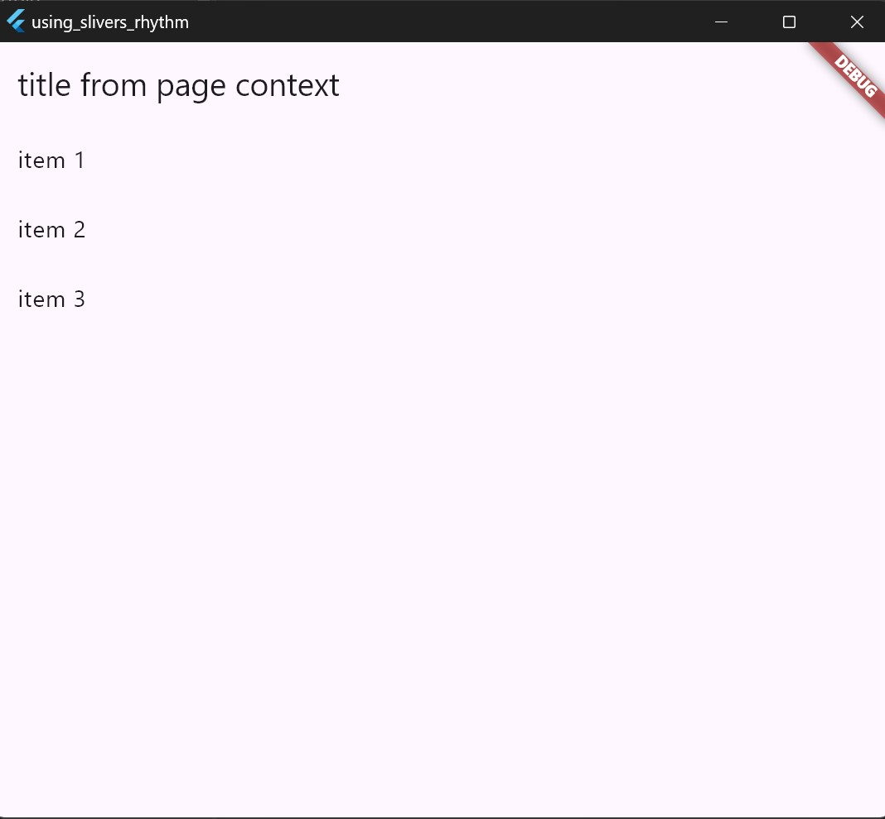

# some -------------------------------
## provider
### provider_min
- lite example to use Like State Manager

..
## a1 &a2 &a3 a2_multi_bloc_provider 
- MultiProvider + logs config

..
## bloc_examples
### bloc_lite_list 

..
## context_read_watch_select/bloc_with_context
### bloc_with_context 

..

## context_read_watch_select/bloc_listener_selector
### bloc_listener_selector
**BlocBuilder**:
- Используется для построения UI на основе состояний, предоставляемых `Bloc`
- Подобен `context.watch()`, так как подписывается на все изменения состояния блока
**BlocListener**:
- Предназначен для выполнения побочных эффектов в ответ на изменения состояния, но не обновляет пользовательский интерфейс.
- Подходит для выполнения таких задач, как навигация, показ уведомлений и т.д
**BlocConsumer**: Комбинирует функциональность BlocBuilder и BlocListener
- Позволяет одновременно слушать изменения состояния и строить UI.
- Подобен комбинации `context.watch()` и `context.read()`.
**BlocSelector**:
- Подобен `context.select()`, позволяет выбрать часть состояния блока и подписаться только на изменения этой части.
- Обеспечивает более гибкий и оптимизированный способ работы с состоянием блока.

..

## **context.read() vs BlocProvider.of<T>**
### context_read_watch_select/context_read_vs_bloc_provider_of
- Так как `flutter_bloc` под капотом использует `provider`, тогда наиболее подобным `context.read()` является использование `BlocProvider.of<T>(context)`.
- Оба метода позволяют получить экземпляр блока и вызвать его методы или диспатчить события без подписки на изменения состояния и перерисовки виджета (конечно если следом, не используется .add(..)).
- Диспатчить события - отправлять случившийся Event в систему управления состоянием, с целью уведомления о том, что произошло определённое действие.

##### Минусы использования BlocProvider.or / BlocListerner / BlocSelector etc вместь context.*()
- Использование специализированных виджетов может показаться избыточным.
- НО дает более точный контроль над жизненным циклом блока, особенно при использовании `MultiBlocProvider`. И дает дополнительные варианты использования включая специфические случаи использования.

..

