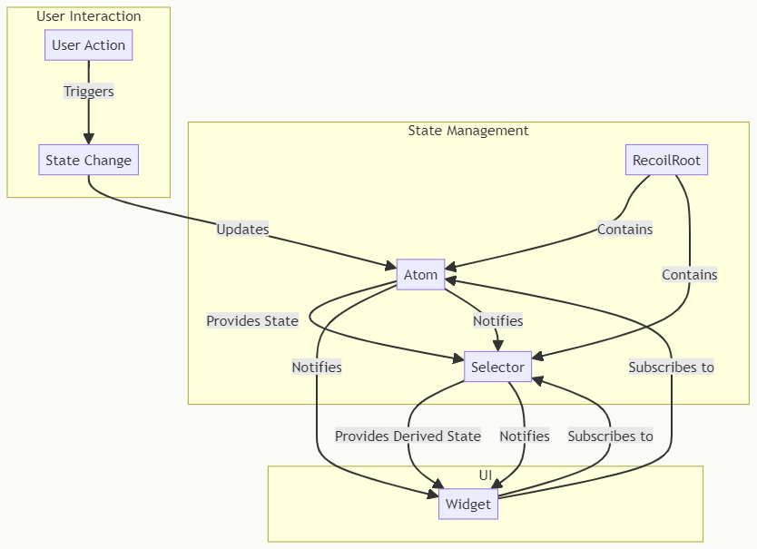
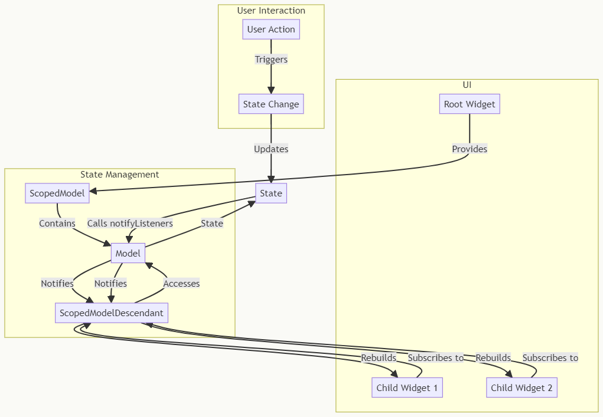

#TOP POP State Managers

## 1 Provider

..

## 2 flutter_bloc

..

## 3 Riverpod

..

## 4 GetX

..

## 5 Redux 

..

## 6 MobX

..

## ----------------------------------------------
# Some Other

## Binder

..

## Fish-Redux

..

## Flutter Command

..

## Recoil

..

## Scoped Model

..

## States_Rebuilder

..

