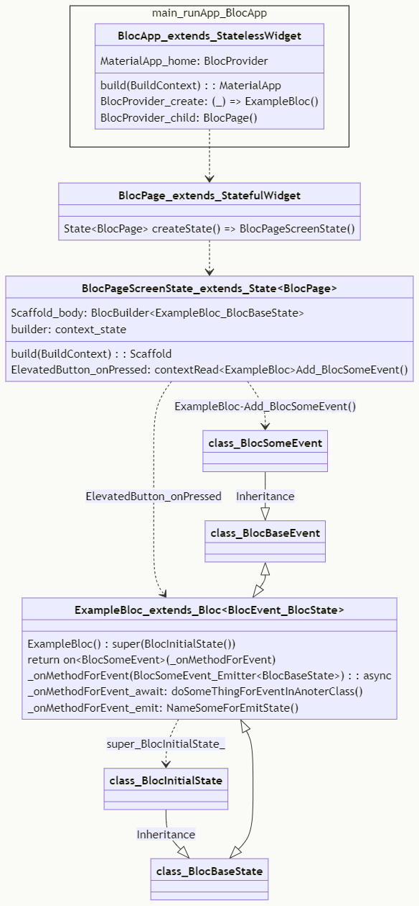

- https://mermaid.js.org/syntax/examples.html
- https://mermaid.js.org/syntax/c4.html
- https://dev.to/ruthmoog/code-graphs-with-mermaid-4h2f
- https://lukemerrett.com/building-c4-diagrams-in-mermaid/
- https://mermaid.js.org/syntax/stateDiagram.html
- https://pnatraj.medium.com/mermaid-uml-flowcharts-statediagrams-class-graphs-7a8989e8ccbd
- https://blog.serverlessadvocate.com/generating-mermaid-syntax-diagrams-with-ai-powered-amazon-bedrock-%EF%B8%8F-29f8dd1602d3
- https://mermaid.js.org/syntax/classDiagram.html

# MMD
## bloc_provider

..
