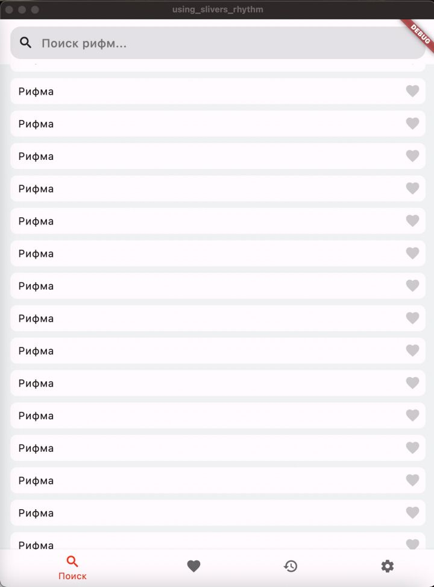
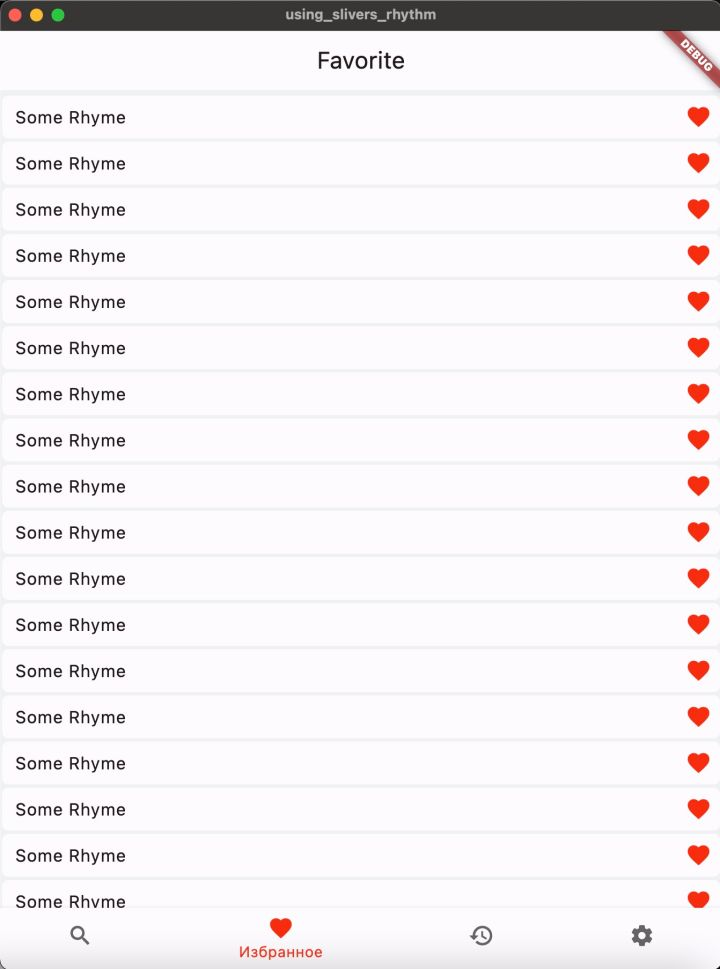
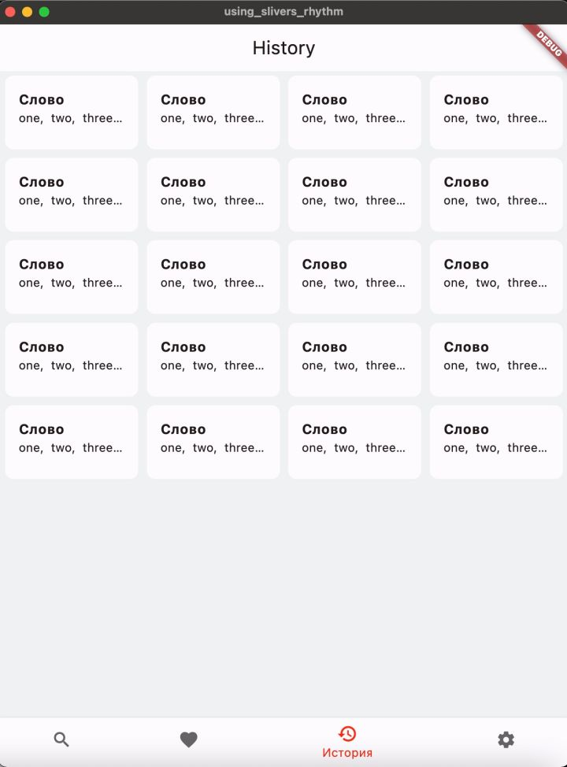
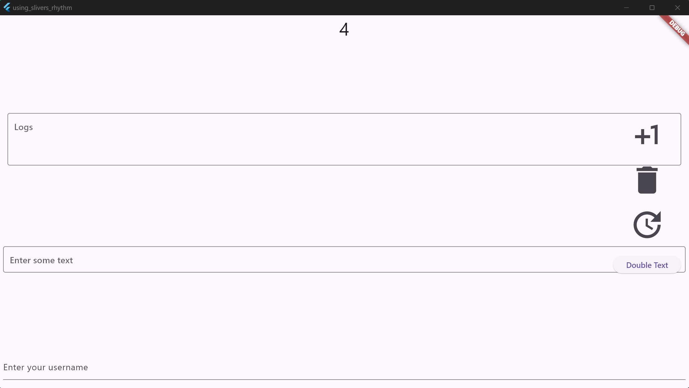
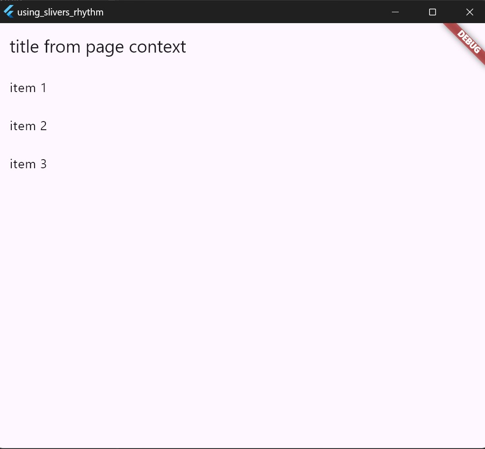
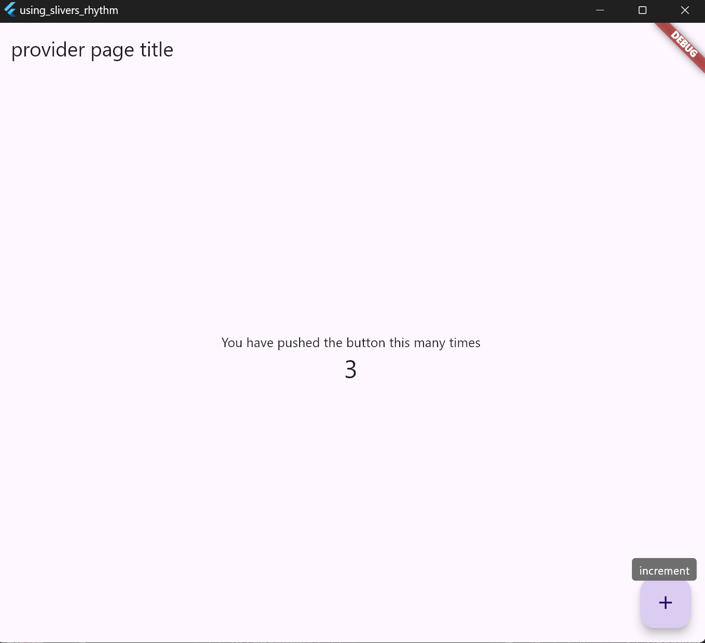
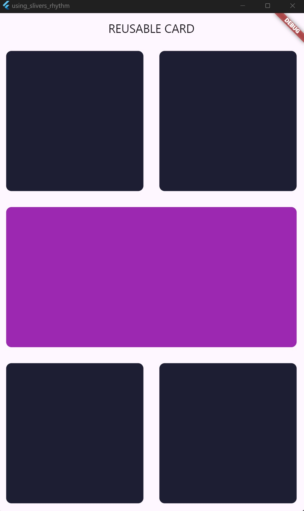
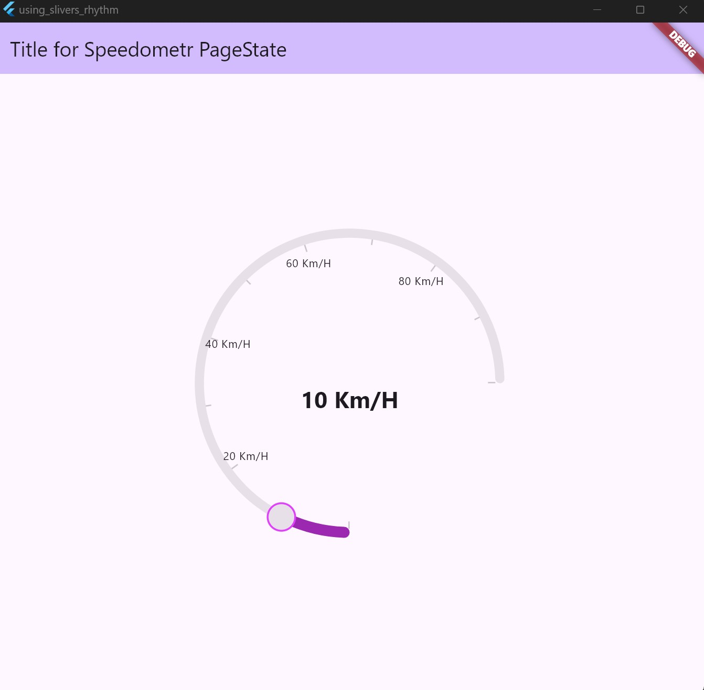
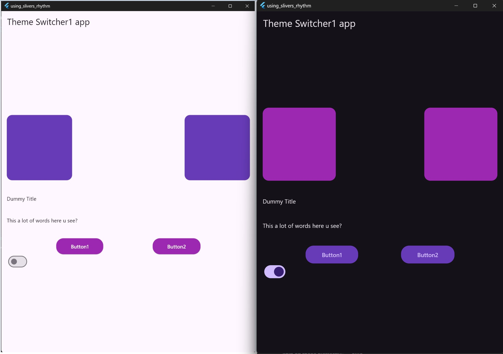

## Getting Started
This project is a starting point for a Flutter application.
A few resources to get you started if this is your first Flutter project:
- [Lab: Write your first Flutter app](https://docs.flutter.dev/get-started/codelab)
- [Cookbook: Useful Flutter samples](https://docs.flutter.dev/cookbook)
For help getting started with Flutter development, view the
[online documentation](https://docs.flutter.dev/), which offers tutorials,
samples, guidance on mobile development, and a full API reference.

# app -------------------------------------------------------------------------
## slivers_rhytm
##### (youtube)[https://www.youtube.com/watch?v=29aHNKMvicc&list=PLtUuja72DaLIywRDTLSSM5kMJLrbrUvbT&index=4&pp=iAQB]
### 1) screen search (720)

### 1.1) screen BottomSheet (lesson #8)

..
### 2) screen favorite

..
### 3) screen history

..
### 4) screen settings

..

# code_concept ----------------------------------------------------------------
## a1 &a2 &a3 a2_multi_bloc_provider 
- MultiProvider + logs config

..
## bloc_examples
### bloc_lite_list 

..
## provider
### provider_lite
- lite example to use Like State Manager

..

# ui --------------------------------------------------------------------------
## five_containers (2 top, 1 middle, 2 bottom)
### container_main

..
## radial_slider
### speedometr

..
## theme_switcher
### theme_switcher1

..

