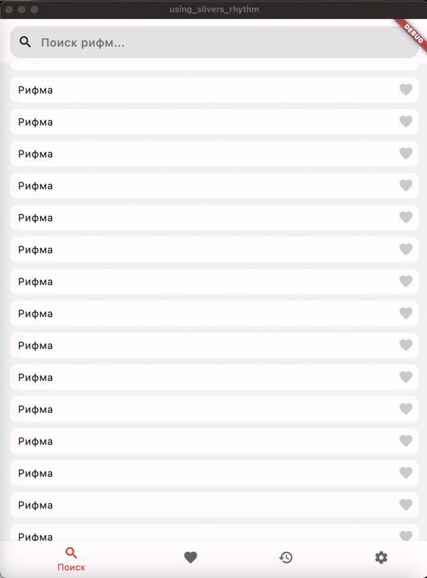

## Getting Started
This project is a starting point for a Flutter application.
A few resources to get you started if this is your first Flutter project:
- [Lab: Write your first Flutter app](https://docs.flutter.dev/get-started/codelab)
- [Cookbook: Useful Flutter samples](https://docs.flutter.dev/cookbook)
For help getting started with Flutter development, view the
[online documentation](https://docs.flutter.dev/), which offers tutorials,
samples, guidance on mobile development, and a full API reference.

## Examples:
### 1) screen search (720)

### 1.1) screen BottomSheet (lesson #8)

..
### 2) screen favorite

..
### 3) screen history

..
### 4) screen settings

..
### 5) a2_bloc MultiProvider + logs config

..
### 6) speedometr (Radial Slider)

..

