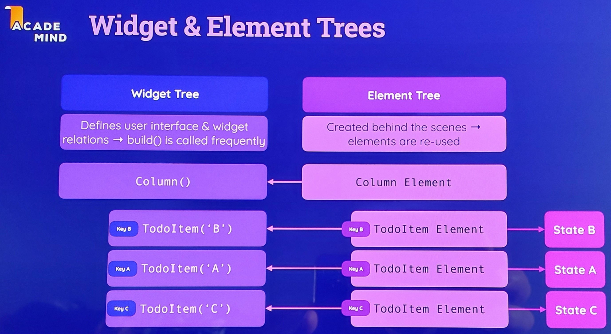
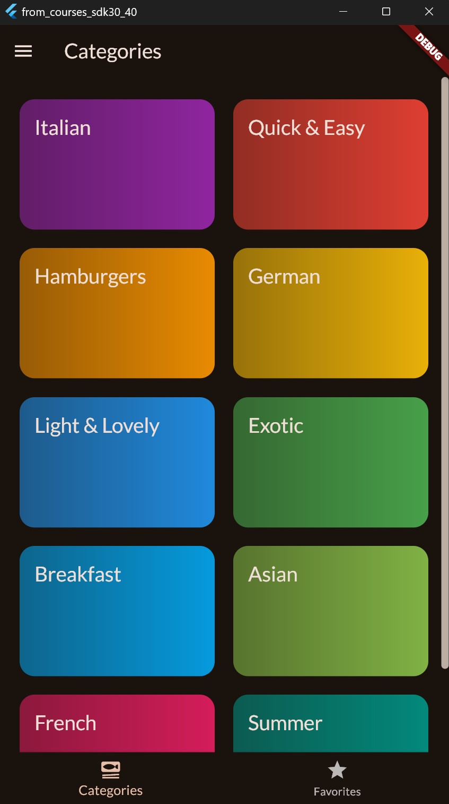

####### ----------------------
- dart pub cache repair
- flutter clean
- dart pub get
- flutter pub get

## complete_guide - Flutter & Dart - The Complete Guide [2025 Edition]
###### https://www.udemy.com/course/learn-flutter-dart-to-build-ios-android-apps/
- https://academind.com/

### les38_dice_roller_app

### les53_quiz_app

 
 
 

### les98_expense_tracker_app (chart &theme &calendar use examples &adaptive)
- if (Platform.isIOS), theme: ThemeData(useMaterial3: true)
- examples to use: Theme from(..) & copyWith(..) & colorScheme
- Theme dark & light by device settings and TextField

 
 
 
 

### les149 todo app with reOrder.. & les146 how ui updated

 
 
 
> 

### les155_meals_app 
  - (multi screen app, with filters for food, using Grid & Navigator)
  - with examples to use: riverpod & animation & GoogleFonts
  - lesson 183 meals app with riverpod example
    - theme: ThemeData(useMaterial3: true) & colorCheme (colorSchemeSeed?)
  - lesson 198 meals app with animation

 
 
 
 
 
 
- lesson 183 meals app with riverpod example
 
 

### les207 shopping list with forms examples
 - forms: building & using & submission & resetting 
 - showing on-screen validation errors
 - TextFormField() integrated with Form()

 
 
 

### les221 http connect to BackEnd

--------------------------------------------------------------------------------

### Learn_flutter
###### https://www.udemy.com/course/learn_flutter/

- main_lesson15_16_img_font
 
- state_ful_less_13_14
- main_lesson13_stateless btn don't work
 
- main_lesson22_row_column
 
- main_lesson23_expanded
 
- main_lesson24_stack
 
- main_lesson25_weather_app
 
- main_lesson26_list_view
 
- main_lesson27_list_view_generate
 
- main_lesson28_list_view_dynamic
 
- main_material_design_9_10
 
- main_scaffold_11_12
 

### pro_flutter
###### https://www.udemy.com/course/pro_flutter/

- lesson_10_1
 
- lesson_10_2
 
- lesson_11
 
- lesson_9
 
- lesson_9/four_main_row_column
 
- lesson_9/six_main_grid_view
 
- navigation_routes_14
- 
-  
- /widgets_examples/list_view7
 
- /widgets_examples/grid_view_table_8
 
- /widgets_examples/column_row_horizontal_vertical
 
- /widgets_examples/lesson9
 
- /widgets_examples/theme_example13_main
 

### other_lessons

- filepicker_dont_ready 
 
- infinite_list
 
- jsonuse_example
 
- 1) using_edittext.dart (720)
 
- 2) text_editor_v2.dart (720)
 
- 3) text_editor_v1.dart (720)
 

